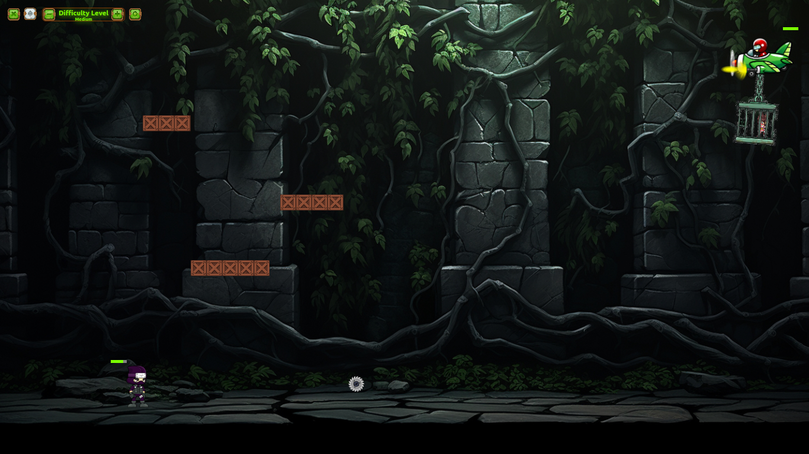
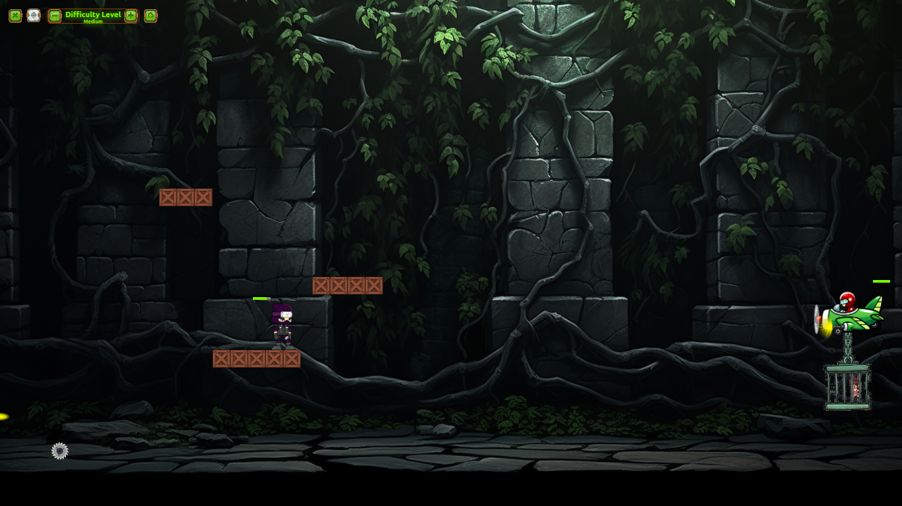
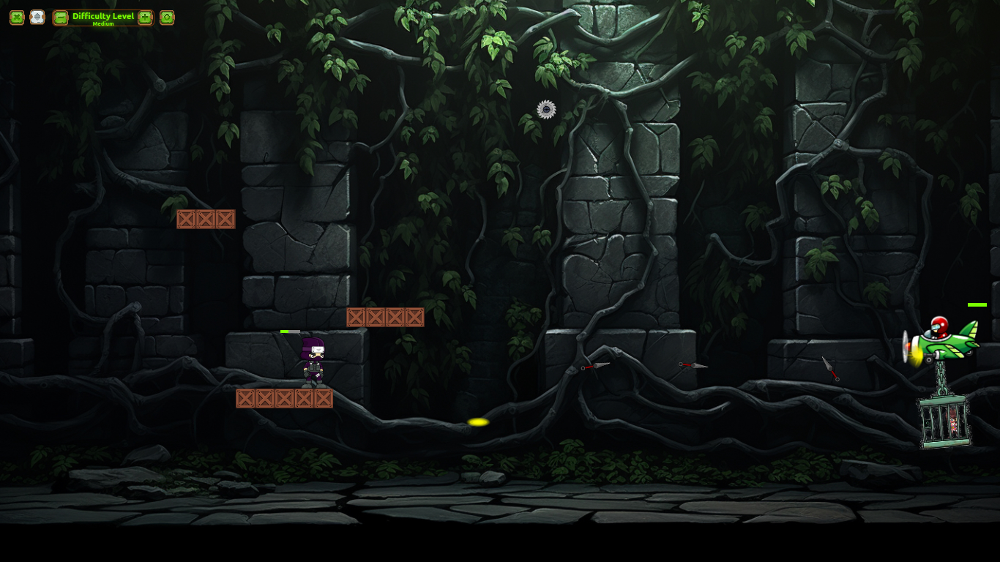
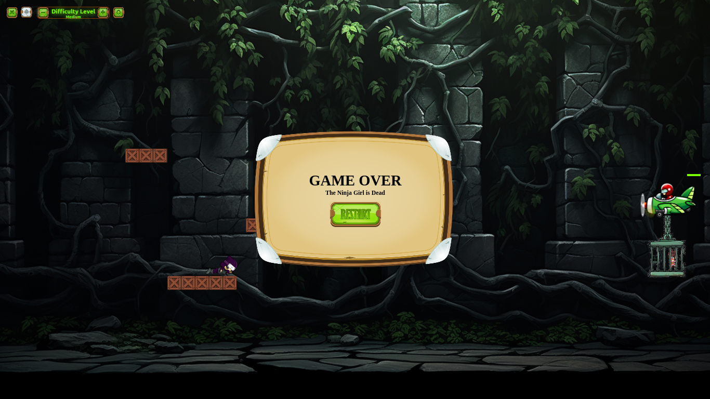
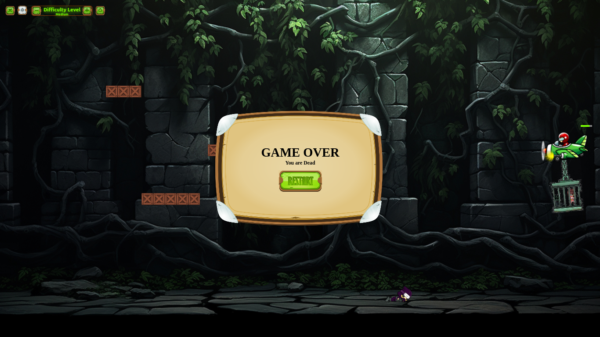
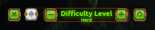

# Save the Ninja Girl Game

Welcome to the Save the Ninja Girl Game! This is a fun and interactive game where the player controls a ninja, helping him to jump, run, avoid obstacles and destroy the plane to save his little girl.
## Game Link

You can play the game [here](https://save-the-ninja-girl-game.web.app/).

## Features

- **Interactive Gameplay**: Control the ninja to jump and run across the screen.
- **Stages and Obstacles**: Navigate through different stages and avoid obstacles to keep the ninja safe.
- **Gravity and Physics**: Realistic gravity effects and collision detection with platforms.
- **Health System**: The game includes health indicators for the character and the plane.

## Screenshots








## How to Play

1. **Start the Game**: Click the "Start" button on the initial screen to begin.
2. **Full Screen Mode**: For an immersive experience, click the full screen button.
3. **Controls**:
    - **Jump**: Press the spacebar to make the ninja jump.
    - **Run**: Use the arrow keys to move the ninja left and right.
    - **Throw the knifes**: Use shift key to throw knifes.

## Installation and Setup

To run this project locally, follow these steps:

1. Clone the repository:
   ```bash
   git clone https://github.com/yourusername/save-the-ninja-girl-game.git

2. **Open the game**:
   Open `index.html` in your preferred web browser.

## Code Structure

The main JavaScript file `game.js` handles the game mechanics, including character movement, animation, gravity, and collision detection. Here's a brief overview of the code structure:

- **Character Animation**: The character's animation is updated in a rendering function that changes the background image based on the character's state (running, jumping, idling, or dead).
- **Gravity and Physics**: Gravity is applied to the character when they are not on a platform or the ground. The `applyGravity` function ensures realistic falling behavior.
- **Jumping and Running**: The `doJump` and `doRun` functions handle the character's jumping and running mechanics, respectively.
- **Collision Detection**: The `checkLanding` function checks if the character has landed on a platform and adjusts their position accordingly.

## Contributing

Contributions are welcome! If you'd like to contribute to the project, please follow these steps:

1. **Fork the repository**.
2. **Create a new branch**: `git checkout -b feature/your-feature-name`.
3. **Commit your changes**: `git commit -m 'Add some feature'`.
4. **Push to the branch**: `git push origin feature/your-feature-name`.
5. **Open a pull request**.

## License

This project is licensed under the MIT License. See the [LICENSE](./LICENSE.txt) file for details.

## Acknowledgments

- Special thanks to the developers of the images and assets used.

## Contact

For any inquiries or feedback, please contact me at jayaneeethanamal@gmail.com.

---

Happy gaming!


